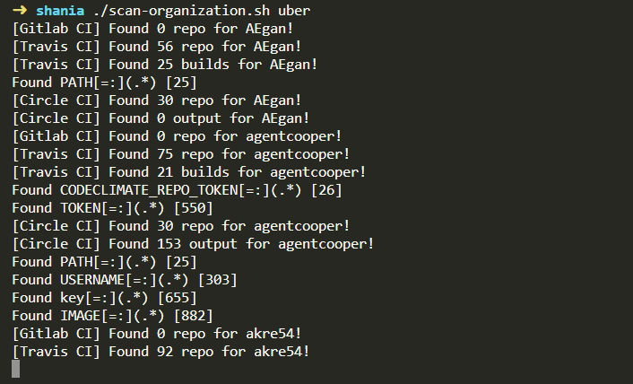

```
     _                 _       
    | |               (_)      
 ___| |__   __ _ _ __  _  __ _ 
/ __| '_ \ / _` | '_ \| |/ _` |
\__ \ | | | (_| | | | | | (_| |
|___/_| |_|\__,_|_| |_|_|\__,_|
                               
```

### Requirement ⛏

`sudo apt install jq`

- Replace [CI_TOKEN] with your key in `main.py` file
- Replace [GITLAB_TOKEN] with your key in `main.py` file
- Replace [GITHUB_TOKEN] with your key in `scan-organization.sh` file

---
### Usage 🎮

Example usage

```
./scan-organisation.sh uber
./scan-organisation.sh [ORGANIZATION_NAME]
./scan-single.sh [USER_HANDLE]
```



---
### FAQ ❓

- jq: error (at <stdin>:4)  Cannot index string with string "login" :  Make sure your [GITHUB_TOKEN] already correct

---
### References 🧾

- https://edoverflow.com/2019/ci-knew-there-would-be-bugs-here/

Special thanks to :
[@Rhynorater](https://twitter.com/Rhynorater)
[@hacker_](https://twitter.com/hacker_)
[@EdOverflow](https://twitter.com/EdOverflow)
[@KarimPwnz](https://twitter.com/KarimPwnz)
[@streaak](https://twitter.com/streaak)
[@d0nutptr](https://twitter.com/d0nutptr)

---
### Legal Disclaimer ⚠

This project is made for educational and ethical testing purposes only. Usage of this tool for attacking targets without prior mutual consent is illegal. Developers assume no liability and are not responsible for any misuse or damage caused by this tool.
